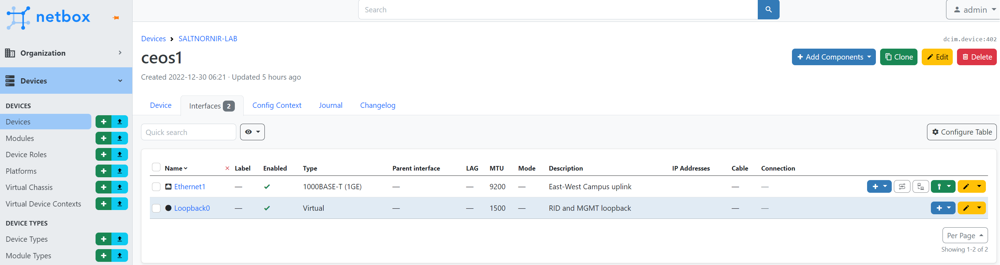

> 5 Feb 2023 by Denis Mulyalin

# Introduction

Templating network devices configuration is a very common approach nowadays,
network testing however, is rarely (if at all) automated. 

SaltStack, Ansible, Nornir and others provide native support for workflows and 
configuration templating using popular templating languages, but this rarely used to 
automate network tests. Jinja2 comes to mind when somebody mentions network 
templates, YAML also pops up as a common way of expressing network related data.

The difficulty of doing network testing is likely due to the lack of structured data that 
can be easily extracted from network devices. As a result, one of common ways of 
dealing with network testing is to use show commands output to interpret devices state 
where operator using gathered output coupled with expert knowledge decides if device
is in a desired state or needs remediation.

However, if software system created that can use plain text to encode tests content to 
do tests, that system is very close to templating those steps using data driven approach.

# Meet Nornir TestsProcessor

In one of my previous 
[blog posts](https://nornir.tech/2021/08/06/testing-your-network-with-nornir-testsprocessor/)
I had a chance to write about the fact that network tests can be classified based on
the scope as local (unit), adjacent (integration) and network (system) tests, the focus of
this post is mainly on local and adjacent types of scenarios. This is due to the fact
that TestProcessor was created to deal with data produced by a single device only.

Original vision behind TestsProcessor was to take a static piece of YAML text:

```yaml
- name: Software version test
  task: show version
  test: contains
  pattern: "17.3.1"
  err_msg: Software version is wrong
  
- name: Logging configuration check
  task: "show run | inc logging"
  test: contains
  pattern: 10.0.0.1
  err_msg: Logging configuration is wrong
```

collect output from network devices and produce tests results:

```
+----+--------+-----------------------------+----------+---------------------------+
|    | host   | name                        | result   | exception                 |
+====+========+=============================+==========+===========================+
|  0 | R1     | Software version test       | FAIL     | Software version is wrong |
+----+--------+-----------------------------+----------+---------------------------+
|  1 | R1     | Logging configuration check | PASS     |                           |
+----+--------+-----------------------------+----------+---------------------------+
```

Another approach, which is common in networking industry, is to take data like this:

```
HostName: switch1

Vlans:
  - VlanId: 10
    VlanName: MGMT
  - VlanId: 20
    VlanName: ACCESS
```

combine it with Jinja2 template:

```
hostname {{ HostName }}
!

vlan {{ Vlan['VlanId'] }}
  name {{ Vlan['VlanName'] }}
!

```

and produce network device configuration:

```
hostname switch1
!
vlan 10
  name MGMT
!
vlan 20
  name ACCESS
```

Bridging two approaches together allows TestsProcessor tests to be dynamically 
created using data stored in host's inventory. For example, if we have these 
two Nornir hosts:

```
hosts:
  jundevice-1:
    hostname: 10.0.0.1
	platform: juniper_junos
	groups: ["auth"]
	data:
	  software_version: 18.1R3-S9
  xrdevice-1:
    hostname: 10.0.0.2
	platform: cisco_xr
	groups: ["auth"]
	data:
	  software_version: 7.5.2

groups:
  auth:
    username: nornir
	password: nornir
```

we can write Jinja2 template:

```
- name: Software version test
  task: show version
  test: contains
  pattern: {{ host.software_version }}
  err_msg: Software version is wrong
```

to produce host specific tests to validate devices state. This idea was implemented 
in Nornir-Salt starting with release 0.16.0, 
[relevant documentation](https://nornir-salt.readthedocs.io/en/latest/Processors/TestsProcessor.html#using-tests-suite-templates).

# Scaling Up using Salt-Nornir

Using Nornir to run tests for a handful (up to hundreds) of devices is great, but
doing same for bigger number (thousands) of devices requires non trivial engineering. 

[Salt-Nornir](https://salt-nornir.readthedocs.io/) helps to scale network management
using Nornir based proxy minions, each handling multiple devices. Because of that, 
network testing too can be scaled using Salt-Nornir proxy minions.

For example, this test suite stored on a master at `/etc/salt/master/tests/testsuite-1.txt`:

```
- task: "show version"
  test: contains
  pattern: "{{ host.software_version }}"
  name: check ceos version
  

- task: "show interface {{ interface.name }}"
  test: contains_lines
  pattern: 
    - {{ interface.admin_status }}
    - {{ interface.line_status }}
    - {{ interface.mtu }}
    - {{ interface.description }}
  name: check interface {{ interface.name }} status

```

coupled with proxy minion pillar inventory:

```
hosts:
  ceos1:
    hostname: 10.0.1.4
    platform: arista_eos
	username: nornir
	password: nornir
    data:
      software_version: cEOS
      interfaces:
        - name: Ethernet1
		  admin_status: is up
          description: East-West Campus uplink
          line_status: line protocol is up
          mtu: IP MTU 9200
        - name: Loopback0
		  admin_status: is up
          description: RID and MGMT loopback
          line_status: line protocol is up
          mtu: IP MTU 1500
```

can produce these test result:

```
[root@salt-master /]# salt nrp1 nr.test suite="salt://tests/testsuite-1.txt" table=brief
nrp1:
    +----+--------+----------------------------------+----------+-------------+
    |    | host   | name                             | result   | exception   |
    +====+========+==================================+==========+=============+
    |  0 | ceos1  | check ceos version               | PASS     |             |
    +----+--------+----------------------------------+----------+-------------+
    |  1 | ceos1  | check interface Ethernet1 status | PASS     |             |
    +----+--------+----------------------------------+----------+-------------+
    |  2 | ceos1  | check interface Loopback1 status | PASS     |             |
    +----+--------+----------------------------------+----------+-------------+
[root@salt-master /]# 
```

Resulting in tests content being dynamically rendered according to data stored in
host's inventory. Combine this with SaltStack reach data sourcing capabilities and
We have a workable solution to test our networks.


# Adding Netbox into the mix

[Netbox](https://github.com/netbox-community/netbox) is a DCIM/IPAM software to model 
and document modern networks. Salt-Nornir comes with Netbox Pillar and Netbox Execution 
Modules, combined togethere, they are capable of sourcing data from Netbox over REST or 
GraphQL API right from Jinja2 templates.

Netbox allows to model devices, here is an example of interfaces modeled in Netbox
for ceos1 device:



Using Salt-Nornir execution module `nr.netbox get_interfaces` functions we can retrieve 
device's interfaces data from Netbox:

```
[root@salt-master /]# salt nrp1 nr.netbox get_interfaces device_name=ceos1 --out=yaml
nrp1:
  Ethernet1:
    bridge: null
    bridge_interfaces: []
    child_interfaces: []
    custom_fields: {}
    description: East-West Campus uplink
    duplex: FULL
    enabled: true
    last_updated: '2022-12-30T11:21:59.922564+00:00'
    mac_address: null
    member_interfaces: []
    mode: null
    mtu: 9200
    parent: null
    speed: null
    tagged_vlans: []
    tags: []
    untagged_vlan: null
    vrf: null
    wwn: null
  Loopback0:
    bridge: null
    bridge_interfaces: []
    child_interfaces: []
    custom_fields: {}
    description: RID and MGMT loopback
    duplex: null
    enabled: true
    last_updated: '2022-12-30T11:22:32.225050+00:00'
    mac_address: null
    member_interfaces: []
    mode: null
    mtu: 1500
    parent: null
    speed: null
    tagged_vlans: []
    tags: []
    untagged_vlan: null
    vrf: null
    wwn: null
```

SaltStack allows to call execution module functions from within the Jinja2 
templates, capable of sourcing data directly during template rendering process.
Lets use that capability in this template producing tests content accordingly:

```

  

- task: "show interface {{ interface_name }}"
  test: contains_lines
  pattern: 
    - {{ interface_data.mtu }}
    - {{ interface_data.description }}

    - "is up, line protocol is up"

    - "is down, admin down"

  name: check interface {{ interface_name }} status

```

Calling `salt['nr.netbox']('get_interfaces', 'ceos1')` inside of the template gives
us access to device interfaces data following with the `for` loop that renders individual
interface's tests. Running above tests suite produces these results:

```
[root@salt-master /]# salt nrp1 nr.test suite="salt://tests/test_suite_ceos1_netbox.j2" table=brief
nrp1:
    +----+--------+----------------------------------+----------+-----------+
    |    | host   | name                             | result   | exception |
    +====+========+==================================+==========+===========+
    |  0 | ceos1  | check interface Loopback0 status | PASS     |           |
    +----+--------+----------------------------------+----------+-----------+
    |  1 | ceos1  | check interface Ethernet1 status | PASS     |           |
    +----+--------+----------------------------------+----------+-----------+
```

Additionally, there is also an option to do `dry_run` to produce tests suite content only
without running the actual tests:

```
[root@salt-master /]# salt nrp1 nr.test suite="salt://tests/test_suite_ceos1_netbox.j2" dry_run=True --out=yaml
nrp1:
  ceos1:
  - name: check interface Loopback0 status
    pattern:
    - 1500
    - RID and MGMT loopback
    - is up, line protocol is up
    task: show interface Loopback0
    test: contains_lines
  - name: check interface Ethernet1 status
    pattern:
    - 9200
    - East-West Campus uplink
    - is up, line protocol is up
    task: show interface Ethernet1
    test: contains_lines
[root@salt-master /]#
```

# Conclusion

Running data driven tests on devices show commands output is not an easy task,
Nornir TestsProcessor, SaltStack Salt-Nornir Proxy Minion and Netbox all combined 
or on its own, provide a great deal of flexibility and capabilities to successfully 
execute in that direction.

Thank you for reading to the end, all the best to you and your networks. 

Feel free to comment on [Twitter](https://twitter.com/DMulyalin/status/1622124303750934528)
or on [GitHub](https://github.com/dmulyalin/dmulyalin.github.io/discussions).


