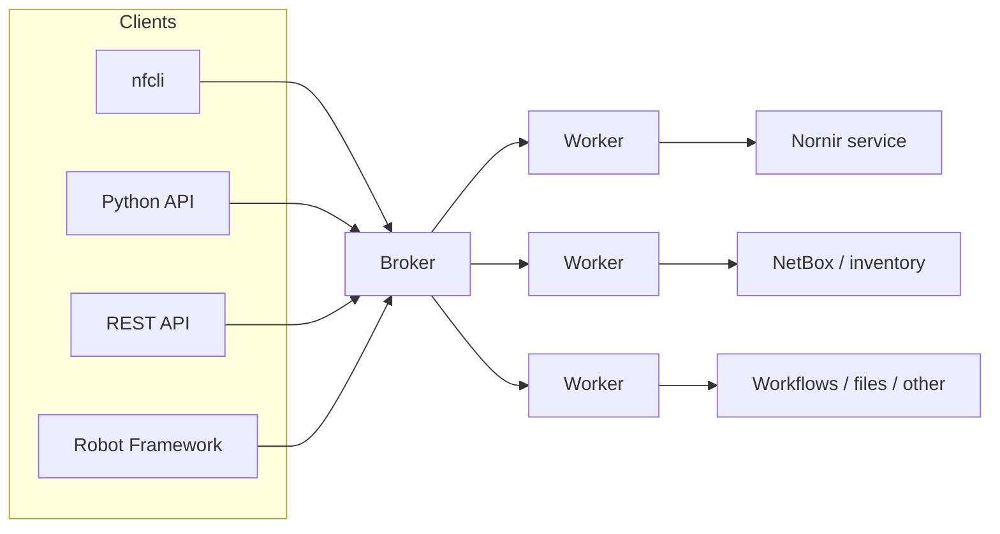
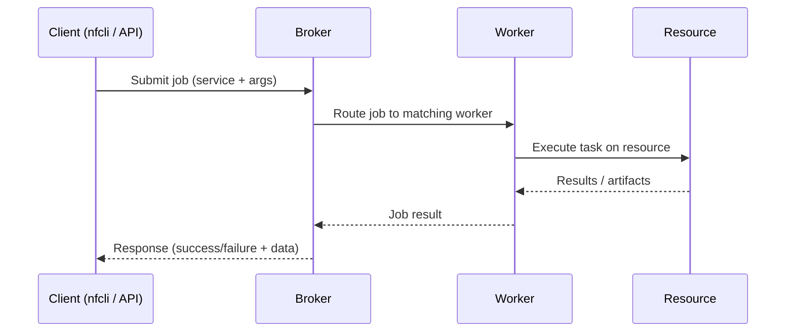

## TL;DR

I built (and keep building) NorFab because I wanted something that helps me in my day-to-day work as a network engineer and boosts my productivity, while still leaning on familiar tools like Nornir, NetBox, Netmiko and many others.

- Repo: [https://github.com/norfablabs/NORFAB](https://github.com/norfablabs/NORFAB)
- Docs: [https://docs.norfablabs.com/](https://docs.norfablabs.com/)
- PyPI: [https://pypi.org/project/norfab/](https://pypi.org/project/norfab/)
- Discussions: [https://github.com/norfablabs/NORFAB/discussions](https://github.com/norfablabs/NORFAB/discussions)

If any part of your automation feels like a pile of scripts, wrappers, and half-shared runbooks… this post is for you.

## The problem (IMHO): network automation is fragmented

Most network automation efforts I’ve seen end up in one of two places. On one side you’ve got heavyweight platforms: solid, enterprise-y, and usually accompanied by dedicated infrastructure and a long rollout. On the other side you’ve got local scripts: fast and joyful… right up until the team grows, the network grows, or someone asks for auditing, reliability, and repeatability.

I’ve been on both sides of this.

I love quick scripts. They’re the fastest way to go from “ugh” to “done”. But once a script becomes popular, it starts collecting “just one more flag”, “just one more exception”, “just one more environment variable”. Then come permissions, scheduling, logging, artifacts, approvals, and auditing. At some point you look up and realize you’re running a tiny bespoke platform… with none of the boring-yet-important platform features.

In reality, many teams need something in between: keep the speed of Python and “small tools”, but get the structure of a platform—without spending months building glue code.

## What is NorFab?

**NorFab (Network Automations Fabric)** is a distributed automation and orchestration framework designed for real-world network operations.

I think of it as an **automation control-plane** for your network. You run a Broker (the hub) and one or more Workers (the executors). Workers expose Services (capabilities like Nornir automation, NetBox integration, workflows, file sharing, REST API, etc.). Then you interact with the whole thing the way you prefer: an interactive CLI (`nfcli`), a Python API, a REST API (FastAPI worker), or even a Robot Framework client.

The big idea is simple: **stop wiring tools together** and instead **focus on productive automation**, automation that delivers outcomes and have real impact.

### Architecture in a picture



## How it works

NorFab uses a service-oriented, brokered architecture. In plain words: a client submits a job (run a task in a service), the broker routes it to the right worker, and the worker executes and returns results.

This design lets you start small (everything on your laptop) and grow to distributed execution (workers across servers/containers) without rewriting your automation logic.

### What actually happens when you run something



## What you can do with it

NorFab is designed around outcomes that network and infrastructure folks actually care about: collecting and acting upon show commands at scale (multi-vendor), pushing configuration safely and repeatably, running network tests that fit into CI, generating diagrams and artifacts from live state, integrating with inventory systems like NetBox, defining multi-step workflows without building your own orchestrator, and sharing templates, test suites, and other assets via built-in file sharing.

## A 5-minute local quickstart

This is the simplest path to “I see value now”. (It’s also how I demo it to myself when I suspect I broke something.)

### 1) Install NorFab

To get the interactive shell and the Nornir service, you can run:

```bash
pip install norfab[nfcli,nornirservice]
```

(You can also install everything with `pip install norfab[full]`.)

### 2) Create a NorFab environment

```bash
nfcli --create-env norfab
```

This scaffolds an `inventory.yaml` and service configs so you can run locally.

### 3) Start the interactive shell

```bash
cd norfab
nfcli
```

From there you can inspect workers, browse services, and run tasks interactively.

If you want more after the quickstart, to keep you going follow [Official Docs](https://docs.norfablabs.com/norfab_getting_started/).

## “Batteries included” doesn’t mean “locked in”

A common fear with platforms is lock-in. NorFab is explicitly built to avoid that:

You can extend it (add your own service/worker plugins), integrate it (Python + CLI + REST makes it easy to plug into existing tooling), and rely on model-driven APIs (Pydantic models help with validation, documentation, and predictable inputs/outputs).

You can start by using built-in services, then add only what your environment needs.

## Why “fabric” matters: adoption across teams

Many automation tools are great for the person who wrote them, but painful for everyone else to consume.

NorFab’s “fabric” approach makes automation shareable. An SRE can call a REST endpoint. A network engineer can use an interactive CLI. A developer can integrate via Python. A QA engineer can run Robot Framework suites.

Same platform, same services, different interfaces, more people can adopt automation without all becoming Python experts.

Personally, this is the part I care about most. If automation requires everyone to become “the automation person”, it doesn’t scale socially. A fabric lets me ship capabilities that others can consume in the way that fits their job.

## Where to go next

If you’re evaluating NorFab, don’t start by “boiling the ocean”. Pick one outcome and make it real in a day. If you want the fastest win, stand up a local environment and use `nfcli` to run operational tasks and explore available services. If you care about CI testing and labbing, use Containerlab + Nornir runtime inventory to build reproducible pipelines your team can rerun on every change. If your world is integration-first, expose automation through REST (FastAPI worker) or Python so other teams can consume it without learning your internal scripts.

If help needed with figuring out how to address the best use-case for your environment, open a discussion on GitHub and share what you’re dealing with. Would be happy to suggest the shortest path to value:

https://github.com/norfablabs/NORFAB/discussions

Also, if you want to see more background and where NorFab came from, check the project README and docs:

https://github.com/norfablabs/NORFAB

https://docs.norfablabs.com/